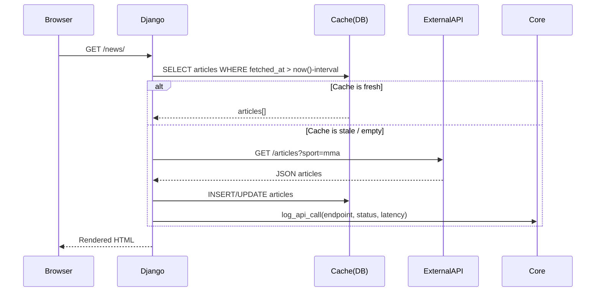
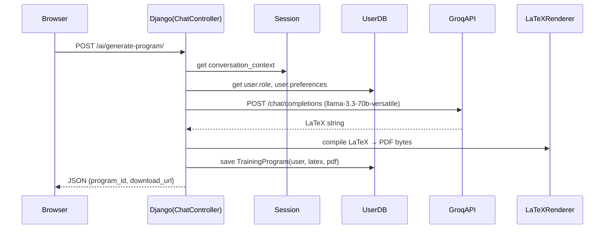
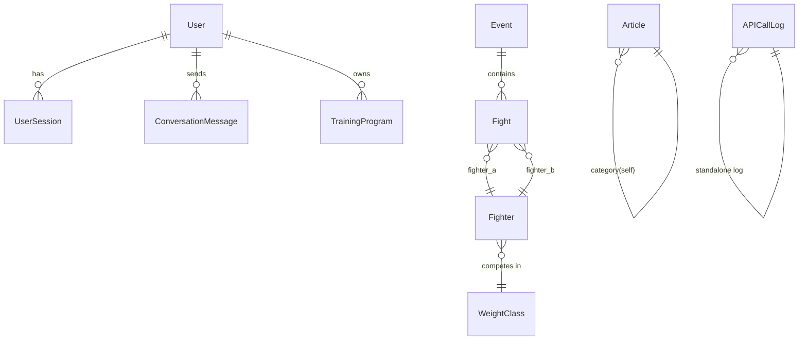

# Design Document — MMA Fighting Platform

## Overview

The MMA Fighting Platform is a Django-based web application that centralises MMA news, fighter profiles, event calendars, AI-powered training assistance, and community tools for fans, amateur athletes, and coaches. The platform integrates external sports/news APIs for live content, exposes an AI chatbot backed by an LLM, and provides an admin panel for user, content, and API management.

### Key Design Goals

- **Separation of concerns**: each functional domain (auth, news, events, AI, admin) is a distinct Django app.
- **Caching-first for external data**: all third-party API responses are cached in PostgreSQL and served from the database to avoid rate-limit exposure and latency.
- **Role-aware AI**: the chatbot adapts its responses and training-program generation based on the authenticated user's declared role (Amateur / Coach).
- **Progressive enhancement**: the frontend is server-rendered HTML + Bootstrap with targeted JavaScript enhancements (countdown timer, stopwatch, chat interface) — no SPA framework required.
- **Observability**: every external API call is logged with timestamp, endpoint, HTTP status, and latency for admin monitoring.

---

## Architecture

### High-Level Architecture

```
┌─────────────────────────────────────────────────────────────────┐
│                        Browser (Client)                         │
│  Bootstrap + Vanilla JS  │  Stopwatch  │  Chat UI  │  Calendar  │
└────────────────────────────────┬────────────────────────────────┘
                                 │ HTTPS
┌────────────────────────────────▼────────────────────────────────┐
│                     Django Application Server                    │
│                                                                  │
│  ┌──────────┐  ┌──────────┐  ┌──────────┐  ┌────────────────┐  │
│  │  auth    │  │  news    │  │  events  │  │  ai_assistant  │  │
│  │  app     │  │  app     │  │  app     │  │  app           │  │
│  └──────────┘  └──────────┘  └──────────┘  └────────────────┘  │
│                                                                  │
│  ┌──────────┐  ┌──────────────────────────────────────────────┐ │
│  │  admin   │  │  core  (shared utilities, logging, caching)  │ │
│  │  app     │  └──────────────────────────────────────────────┘ │
│  └──────────┘                                                    │
│                                                                  │
│  ┌──────────────────────────────────────────────────────────┐   │
│  │              Django ORM  /  PostgreSQL                    │   │
│  └──────────────────────────────────────────────────────────┘   │
└──────────────────────────────────────────────────────────────────┘
         │                        │                    │
         ▼                        ▼                    ▼
  External News/Sports API    Groq API            LaTeX / PDF
  (e.g. SportNews, RapidAPI)  (llama-3.3-70b)    (pdflatex / WeasyPrint)
```

### Django App Structure

```
mma_platform/
├── manage.py
├── mma_platform/          # project settings, urls, wsgi
│   ├── settings/
│   │   ├── base.py
│   │   ├── development.py
│   │   └── production.py
│   ├── urls.py
│   └── wsgi.py
├── apps/
│   ├── accounts/          # Requirement 1, 2 — auth, profiles, roles
│   ├── news/              # Requirement 3, 10 — news fetching & display
│   ├── events/            # Requirement 4, 5 — fighters, events, calendar
│   ├── training/          # Requirement 6 — stopwatch (client-side)
│   ├── ai_assistant/      # Requirement 7, 8 — chatbot, program generation
│   └── core/              # shared: API logging, caching helpers, base models
├── templates/
├── static/
└── requirements.txt
```

### Request Flow — News Fetch (with Cache)



### Request Flow — AI Training Program Generation



---

## Components and Interfaces

### 1. `accounts` App

**Responsibilities**: registration, login, logout, session management, profile CRUD, role management.

**Key Views**:
- `RegisterView` — validates form, creates `User`, redirects to profile
- `LoginView` — authenticates, creates Django session, redirects to home
- `LogoutView` — invalidates session, redirects to home
- `ProfileView` — displays and updates profile fields and role

**Key Forms**:
- `RegistrationForm` — validates unique email, password ≥ 8 chars, role choice
- `ProfileUpdateForm` — validates email format, role choice

**Interfaces**:
```python
# accounts/services.py
def register_user(username: str, email: str, password: str, role: str) -> User
def authenticate_user(email: str, password: str) -> Optional[User]
def update_profile(user: User, data: dict) -> User
def suspend_user(user: User) -> None          # called by admin
def invalidate_sessions(user: User) -> None   # called on suspension
```

### 2. `news` App

**Responsibilities**: scheduled fetching from External_API, article storage, category filtering, display.

**Key Components**:
- `NewsAPIClient` — wraps HTTP calls to the configured news API, records latency
- `NewsFetchService` — orchestrates fetch → deduplicate → store cycle
- `NewsFetchScheduler` — Django management command + APScheduler/Celery beat task

**Key Views**:
- `NewsListView` — paginated, filterable by category, sorted by `published_at` DESC
- `NewsDetailView` — single article with source attribution and external link

**Interfaces**:
```python
# news/services.py
def fetch_and_store_articles() -> FetchResult   # returns {new_count, errors}
def get_articles(category: str | None, page: int) -> Page[Article]
def hide_article(article_id: int) -> None       # called by admin
```

### 3. `events` App

**Responsibilities**: fighter profiles, event calendar, countdown timer data, fight results.

**Key Components**:
- `EventsAPIClient` — wraps HTTP calls to the sports API
- `EventSyncService` — syncs events and fighter data from External_API
- `CountdownService` — returns the nearest upcoming event and its remaining seconds

**Key Views**:
- `FighterListView` / `FighterDetailView`
- `EventCalendarView` — renders calendar data as JSON for JS calendar widget
- `EventDetailView` — full fight card, venue, broadcast info
- `CountdownAPIView` — JSON endpoint polled by the frontend countdown widget

**Interfaces**:
```python
# events/services.py
def search_fighters(query: str) -> list[Fighter]
def get_next_event() -> Optional[Event]
def get_event_detail(event_id: int) -> EventDetail
def sync_events_from_api() -> SyncResult
```

### 4. `ai_assistant` App

**Responsibilities**: chat interface, conversation context management, training program generation, LaTeX compilation, PDF storage.

**Key Components**:
- `LLMClient` — wraps the Groq API using the `groq` Python SDK (`groq>=0.9`), targets the `llama-3.3-70b-versatile` model, handles retries and 10-second timeout
- `ChatService` — manages per-session conversation history, enforces topic restriction
- `ProgramGeneratorService` — builds the prompt from user role + parameters, parses LaTeX response from Groq
- `LaTeXCompiler` — calls `pdflatex` (subprocess) or WeasyPrint to produce PDF bytes

**Groq Configuration**:
```python
# settings/base.py
GROQ_API_KEY = env("GROQ_API_KEY")          # loaded from .env
GROQ_MODEL   = "llama-3.3-70b-versatile"    # default model
GROQ_TIMEOUT = 10                            # seconds
```

**LLMClient interface**:
```python
# ai_assistant/llm_client.py
from groq import Groq

class LLMClient:
    def __init__(self):
        self.client = Groq(api_key=settings.GROQ_API_KEY)
        self.model  = settings.GROQ_MODEL

    def chat(self, messages: list[dict], temperature: float = 0.7) -> str:
        """Send a list of {role, content} messages and return the assistant reply."""
        response = self.client.chat.completions.create(
            model=self.model,
            messages=messages,
            temperature=temperature,
            timeout=settings.GROQ_TIMEOUT,
        )
        return response.choices[0].message.content
```

**Key Views**:
- `ChatView` — WebSocket or AJAX endpoint for chat messages
- `GenerateProgramView` — POST endpoint that triggers program generation
- `ProgramDownloadView` — serves the stored PDF

**Interfaces**:
```python
# ai_assistant/services.py
def send_message(session_key: str, user: User, message: str) -> str
def generate_training_program(user: User, params: ProgramParams) -> TrainingProgram
def compile_latex_to_pdf(latex_source: str) -> bytes
def get_saved_programs(user: User) -> list[TrainingProgram]
```

### 5. `core` App

**Responsibilities**: shared base models, API call logging, caching utilities.

**Key Components**:
- `APICallLogger` — middleware/decorator that wraps any external HTTP call and writes an `APICallLog` record
- `CacheHelper` — thin wrapper around Django's cache framework (database or Redis backend)

**Interfaces**:
```python
# core/logging.py
def log_api_call(endpoint: str, status_code: int, latency_ms: int, error: str | None) -> APICallLog

# core/cache.py
def get_or_fetch(key: str, fetch_fn: Callable, ttl_seconds: int) -> Any
```

### 6. Admin Panel (`admin` app + Django Admin customisation)

**Responsibilities**: user management, content supervision, API monitoring dashboard, CSV export.

Built on top of Django's built-in admin with custom `ModelAdmin` classes and a custom dashboard view.

**Key Admin Views**:
- `UserAdmin` — list with search, status toggle, session invalidation action
- `ArticleAdmin` — list with hide action, manual refresh trigger
- `APIMonitorDashboardView` — custom view showing 24h/30d stats, last error
- `APICallLogAdmin` — filterable log list with CSV export action

---

## Data Models

### `accounts` Models

```python
class User(AbstractUser):
    ROLE_CHOICES = [("amateur", "Amateur"), ("coach", "Coach"), ("admin", "Admin")]
    role = models.CharField(max_length=10, choices=ROLE_CHOICES, default="amateur")
    preferences = models.JSONField(default=dict, blank=True)
    is_suspended = models.BooleanField(default=False)
    # username, email, password inherited from AbstractUser

class UserSession(models.Model):
    """Tracks active Django sessions per user for forced invalidation."""
    user = models.ForeignKey(User, on_delete=models.CASCADE, related_name="tracked_sessions")
    session_key = models.CharField(max_length=40, unique=True)
    created_at = models.DateTimeField(auto_now_add=True)
    expires_at = models.DateTimeField()
```

### `news` Models

```python
class Article(models.Model):
    CATEGORY_CHOICES = [
        ("general", "General MMA"),
        ("fighter", "Fighter News"),
        ("preview", "Event Previews"),
        ("results", "Fight Results"),
    ]
    external_id = models.CharField(max_length=255, unique=True)
    title = models.CharField(max_length=500)
    summary = models.TextField()
    source_name = models.CharField(max_length=200)
    source_url = models.URLField()
    category = models.CharField(max_length=20, choices=CATEGORY_CHOICES)
    published_at = models.DateTimeField(db_index=True)
    fetched_at = models.DateTimeField(auto_now=True)
    is_hidden = models.BooleanField(default=False, db_index=True)

    class Meta:
        ordering = ["-published_at"]
        indexes = [models.Index(fields=["category", "-published_at"])]
```

### `events` Models

```python
class WeightClass(models.Model):
    name = models.CharField(max_length=50, unique=True)   # e.g. "Lightweight"
    limit_kg = models.DecimalField(max_digits=5, decimal_places=2)

class Fighter(models.Model):
    external_id = models.CharField(max_length=255, unique=True)
    full_name = models.CharField(max_length=200, db_index=True)
    nationality = models.CharField(max_length=100)
    weight_class = models.ForeignKey(WeightClass, on_delete=models.SET_NULL, null=True)
    fighting_style = models.CharField(max_length=100, blank=True)
    wins = models.PositiveIntegerField(default=0)
    losses = models.PositiveIntegerField(default=0)
    draws = models.PositiveIntegerField(default=0)
    updated_at = models.DateTimeField(auto_now=True)

class Event(models.Model):
    STATUS_CHOICES = [("upcoming", "Upcoming"), ("live", "Live"), ("completed", "Completed"), ("cancelled", "Cancelled")]
    external_id = models.CharField(max_length=255, unique=True)
    name = models.CharField(max_length=300)
    date = models.DateTimeField(db_index=True)
    location = models.CharField(max_length=300)
    venue = models.CharField(max_length=300, blank=True)
    broadcast_info = models.TextField(blank=True)
    status = models.CharField(max_length=20, choices=STATUS_CHOICES, default="upcoming")
    updated_at = models.DateTimeField(auto_now=True)

class Fight(models.Model):
    OUTCOME_CHOICES = [("win", "Win"), ("loss", "Loss"), ("draw", "Draw"), ("nc", "No Contest")]
    METHOD_CHOICES = [("ko", "KO/TKO"), ("sub", "Submission"), ("dec", "Decision"), ("dq", "DQ"), ("other", "Other")]
    event = models.ForeignKey(Event, on_delete=models.CASCADE, related_name="fights")
    fighter_a = models.ForeignKey(Fighter, on_delete=models.CASCADE, related_name="fights_as_a")
    fighter_b = models.ForeignKey(Fighter, on_delete=models.CASCADE, related_name="fights_as_b")
    winner = models.ForeignKey(Fighter, on_delete=models.SET_NULL, null=True, blank=True, related_name="wins_set")
    method = models.CharField(max_length=10, choices=METHOD_CHOICES, blank=True)
    is_main_event = models.BooleanField(default=False)
    bout_order = models.PositiveSmallIntegerField(default=0)
```

### `ai_assistant` Models

```python
class ConversationMessage(models.Model):
    ROLE_CHOICES = [("user", "User"), ("assistant", "Assistant")]
    session_key = models.CharField(max_length=40, db_index=True)
    user = models.ForeignKey("accounts.User", on_delete=models.CASCADE)
    role = models.CharField(max_length=10, choices=ROLE_CHOICES)
    content = models.TextField()
    created_at = models.DateTimeField(auto_now_add=True)

    class Meta:
        ordering = ["created_at"]
        indexes = [models.Index(fields=["session_key", "created_at"])]

class TrainingProgram(models.Model):
    user = models.ForeignKey("accounts.User", on_delete=models.CASCADE, related_name="training_programs")
    title = models.CharField(max_length=300)
    latex_source = models.TextField()
    pdf_file = models.FileField(upload_to="training_programs/")
    generated_at = models.DateTimeField(auto_now_add=True)
    parameters = models.JSONField(default=dict)   # goals, level, days/week, limitations

    class Meta:
        ordering = ["-generated_at"]
```

### `core` Models

```python
class APICallLog(models.Model):
    endpoint = models.CharField(max_length=500)
    status_code = models.PositiveSmallIntegerField()
    latency_ms = models.PositiveIntegerField()
    error_message = models.TextField(blank=True)
    called_at = models.DateTimeField(auto_now_add=True, db_index=True)

    class Meta:
        ordering = ["-called_at"]
        indexes = [models.Index(fields=["called_at", "status_code"])]
```

### Entity-Relationship Overview



---

## Correctness Properties

*A property is a characteristic or behavior that should hold true across all valid executions of a system — essentially, a formal statement about what the system should do. Properties serve as the bridge between human-readable specifications and machine-verifiable correctness guarantees.*

### Property 1: Registration rejects duplicate emails

*For any* email address already associated with an existing User account, submitting a registration form with that email SHALL result in an error response and no new User account being created.

**Validates: Requirements 1.3**

---

### Property 2: Registration rejects short passwords

*For any* password string whose length is strictly less than 8 characters, submitting a registration form with that password SHALL result in a validation error and no new User account being created.

**Validates: Requirements 1.4**

---

### Property 3: Role context propagates to AI responses

*For any* User whose declared role is changed, all subsequent AI_Assistant interactions within the same Session SHALL reflect the updated role context (i.e., Amateur-oriented vs. Coach-oriented content).

**Validates: Requirements 2.6**

---

### Property 4: News listing is sorted by publication date descending

*For any* page of articles returned by the News_Module, every article's `published_at` timestamp SHALL be greater than or equal to the `published_at` timestamp of every article that follows it in the list.

**Validates: Requirements 3.3**

---

### Property 5: Hidden articles are excluded from all user-facing listings

*For any* article marked as hidden by an Admin, that article SHALL NOT appear in any news listing or category-filtered view returned to a non-Admin User.

**Validates: Requirements 3.5, 10.2**

---

### Property 6: Category filter returns only matching articles

*For any* category selection, every article returned by the News_Module SHALL belong to that category and no article from a different category SHALL be included.

**Validates: Requirements 3.5**

---

### Property 7: Fighter search returns only name-matching profiles

*For any* search query string, every Fighter profile returned by the Events_Module SHALL have a `full_name` that contains the query string (case-insensitive), and no profile whose name does not match SHALL be included.

**Validates: Requirements 4.2**

---

### Property 8: Training program content matches user role

*For any* generated TrainingProgram, if the requesting User's role is Amateur then the program content SHALL include foundational technique and general conditioning elements; if the role is Coach then the program SHALL include periodization structures and athlete management guidance.

**Validates: Requirements 8.2**

---

### Property 9: Training program round-trip persistence

*For any* TrainingProgram generated and saved to a User's profile, retrieving that program from the profile SHALL return a record with identical `latex_source`, `parameters`, and an accessible PDF download URL.

**Validates: Requirements 8.4, 8.5**

---

### Property 10: API call log completeness

*For any* HTTP call made to an External_API, an `APICallLog` record SHALL be created containing the endpoint, HTTP status code, and latency in milliseconds before the response is returned to the caller.

**Validates: Requirements 11.2**

---

### Property 11: Admin-only access enforcement

*For any* request to an Admin_Panel URL made by a User whose role is not Admin, the system SHALL redirect the request to the home page and SHALL NOT render any admin content.

**Validates: Requirements 9.1, 9.2**

---

### Property 12: Suspended user sessions are invalidated

*For any* User account that is suspended by an Admin, all `UserSession` records for that User SHALL be deleted and the corresponding Django sessions SHALL be invalidated before the suspension response is returned.

**Validates: Requirements 9.5**

---

## Error Handling

### Authentication Errors

- Invalid credentials: return HTTP 200 with form error (do not reveal which field failed — Requirement 1.6).
- Suspended account login attempt: display a generic "account unavailable" message; do not confirm suspension status to the requester.
- HTTPS enforcement: Django `SECURE_SSL_REDIRECT = True` in production; any HTTP request is redirected.

### External API Errors

- All `NewsAPIClient` and `EventsAPIClient` calls are wrapped in try/except blocks.
- On `requests.Timeout` or `requests.ConnectionError`: log the error, increment error counter, return cached data if available, surface a "last updated at …" indicator to the user (Requirement 3.7).
- On HTTP 4xx/5xx: log with `log_api_call(status_code=..., error_message=...)`, do not propagate the raw error to the user.
- Retry strategy: exponential back-off with a maximum of 3 retries for transient 5xx errors.

### LLM / Groq Service Errors

- On `groq.APITimeoutError` (> 10 s) or `groq.APIConnectionError`: return a user-friendly message "The AI assistant is temporarily unavailable. Please try again later." (Requirement 7.5).
- On `groq.RateLimitError`: back off for 5 seconds and retry once; if the second attempt also fails, surface the unavailability message.
- Conversation context is stored in the database; if the Groq call fails, the user message is still persisted so the user can retry.

### LaTeX Compilation Errors

- If `pdflatex` subprocess exits with a non-zero code: log the LaTeX source and compiler output, return an error to the user asking them to retry, do not save a broken `TrainingProgram` record.

### Unhandled Server Errors

- Django `handler500` is overridden to render a branded error page.
- All unhandled exceptions are logged with full stack trace via Django's logging framework (Requirement 13.4).
- In production, `DEBUG = False` and `ADMINS` is configured for email alerts.

### Input Validation

- All forms use Django's form validation layer; errors are returned as field-level messages.
- API endpoints (AJAX/JSON) return structured error responses: `{"error": "...", "field": "..."}`.
- Profile email format validation is performed client-side (HTML5 `type="email"`) and server-side (Requirement 2.4).

---

## Testing Strategy

### Unit Tests

Unit tests cover pure business logic in service modules, form validation, and model methods. They use Django's `TestCase` with an in-memory SQLite database (or PostgreSQL in CI).

Focus areas:
- `RegistrationForm` validation: duplicate email, short password, missing fields
- `ProfileUpdateForm` validation: invalid email format
- `NewsFetchService.deduplicate()`: articles with duplicate `external_id` are not re-inserted
- `ChatService.is_on_topic()`: topic restriction logic
- `ProgramGeneratorService.build_prompt()`: prompt includes correct role context
- `CountdownService.get_next_event()`: returns the event with the nearest future `date`
- `APICallLogger`: log record is created with correct fields

### Property-Based Tests

Property-based testing is applied using [Hypothesis](https://hypothesis.readthedocs.io/) (Python PBT library). Each property test runs a minimum of 100 iterations.

**Property 1 — Registration rejects duplicate emails**
```
Feature: mma-fighting-platform, Property 1: Registration rejects duplicate emails
```
Generate random valid user data; register once successfully; attempt to register again with the same email; assert the second attempt returns a validation error and the User count is unchanged.

**Property 2 — Registration rejects short passwords**
```
Feature: mma-fighting-platform, Property 2: Registration rejects short passwords
```
Generate random strings of length 0–7; assert that `RegistrationForm` with that password is invalid and no User is created.

**Property 3 — Role context propagates to AI responses**
```
Feature: mma-fighting-platform, Property 3: Role context propagates to AI responses
```
Generate random role values (Amateur / Coach); update the user's role; call `ProgramGeneratorService.build_prompt()`; assert the returned prompt string contains role-specific keywords.

**Property 4 — News listing sorted by publication date descending**
```
Feature: mma-fighting-platform, Property 4: News listing sorted by publication date descending
```
Generate a random list of Article objects with random `published_at` values; insert them; call `get_articles()`; assert the returned list is sorted in descending order of `published_at`.

**Property 5 — Hidden articles excluded from user-facing listings**
```
Feature: mma-fighting-platform, Property 5: Hidden articles excluded from user-facing listings
```
Generate a random set of articles, mark a random subset as hidden; call `get_articles()`; assert no hidden article appears in the result.

**Property 6 — Category filter returns only matching articles**
```
Feature: mma-fighting-platform, Property 6: Category filter returns only matching articles
```
Generate articles across all categories; call `get_articles(category=X)` for a random category X; assert every returned article has `category == X`.

**Property 7 — Fighter search returns only name-matching profiles**
```
Feature: mma-fighting-platform, Property 7: Fighter search returns only name-matching profiles
```
Generate a random list of Fighter objects with random names; call `search_fighters(query)`; assert every returned fighter's `full_name` contains the query (case-insensitive) and no non-matching fighter is included.

**Property 8 — Training program content matches user role**
```
Feature: mma-fighting-platform, Property 8: Training program content matches user role
```
Generate random `ProgramParams`; call `build_prompt(user_role="amateur", params)` and `build_prompt(user_role="coach", params)`; assert the amateur prompt contains foundational keywords and the coach prompt contains periodization keywords.

**Property 9 — Training program round-trip persistence**
```
Feature: mma-fighting-platform, Property 9: Training program round-trip persistence
```
Generate random program parameters; call `generate_training_program(user, params)` (with mocked LLM and LaTeX compiler); retrieve the saved program; assert `latex_source` and `parameters` are identical to what was saved.

**Property 10 — API call log completeness**
```
Feature: mma-fighting-platform, Property 10: API call log completeness
```
Generate random endpoint strings and HTTP status codes; call `log_api_call(endpoint, status_code, latency_ms)`; assert an `APICallLog` record exists with matching fields.

**Property 11 — Admin-only access enforcement**
```
Feature: mma-fighting-platform, Property 11: Admin-only access enforcement
```
Generate random non-admin role values; create a User with that role; make a GET request to each admin URL; assert every response is a redirect (HTTP 302) to the home page.

**Property 12 — Suspended user sessions are invalidated**
```
Feature: mma-fighting-platform, Property 12: Suspended user sessions are invalidated
```
Generate a random number (1–10) of active sessions for a user; call `suspend_user(user)`; assert all `UserSession` records for that user are deleted and the Django session store contains no matching session keys.

### Technologies utilisées (summary)

| Layer | Technology |
|---|---|
| Backend | Python 3.12, Django 5.x |
| Frontend | HTML5, Bootstrap 5, Vanilla JS |
| Database | PostgreSQL 16 |
| AI / LLM | Groq API — `llama-3.3-70b-versatile` via `groq` Python SDK |
| News/Sports data | External REST API (e.g. RapidAPI SportNews) |
| PDF generation | `pdflatex` (TeX Live) or WeasyPrint fallback |
| Task scheduling | APScheduler (dev) / Celery + Redis (prod) |
| Testing | pytest-django, Hypothesis (PBT), Jest (JS) |

Integration tests verify the wiring between components using Django's test client and a real PostgreSQL test database.

- News fetch cycle: mock the External_API HTTP response; call `fetch_and_store_articles()`; assert articles are stored and `APICallLog` is created.
- Admin manual refresh: POST to the admin refresh endpoint; assert the news fetch is triggered and the response includes `new_count`.
- Chat endpoint: POST a message to `/ai/chat/`; assert a `ConversationMessage` is saved and a response is returned.
- CSV export: GET the API log export endpoint with a date range; assert the response is `text/csv` with correct headers.

### Frontend / Stopwatch Tests

The Stopwatch (Requirement 6) is a pure client-side JavaScript component. It is tested with Jest:
- Start → elapsed time increases
- Stop → elapsed time freezes
- Reset → elapsed time returns to 0
- No server round-trips occur during operation (mock `fetch` is never called)

### Performance and Accessibility

- Lighthouse CI is integrated into the CI pipeline to enforce a mobile performance score ≥ 70 on primary pages (Requirement 12.3).
- Django Debug Toolbar is used in development to identify N+1 queries.
- Load testing with Locust verifies the 3-second response time SLA under 100 concurrent users (Requirement 13.2).
